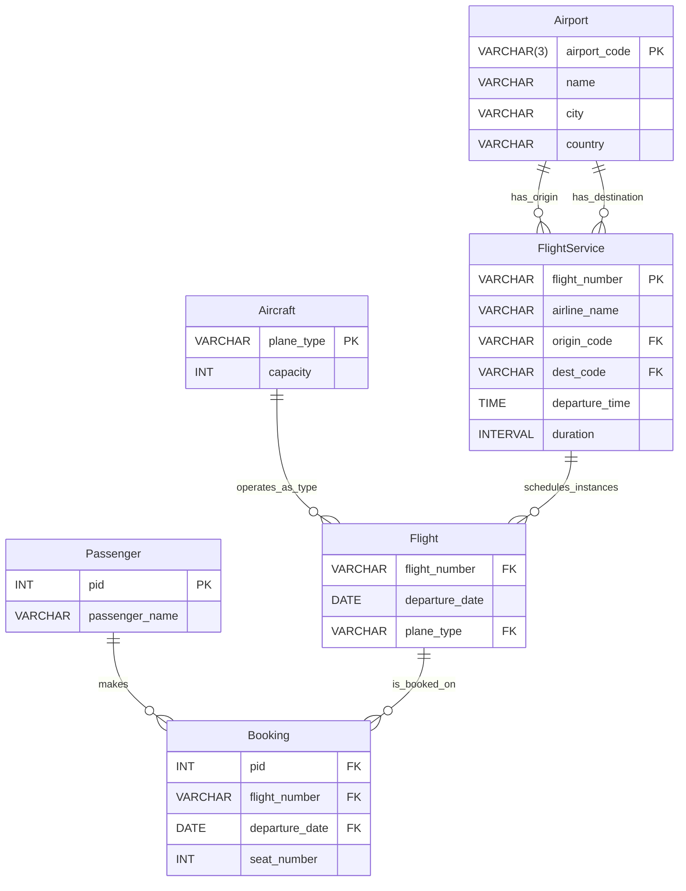

## Problem 2(b) – ER Diagram (Airline Flights and Booking)

This ER-style diagram matches the narrative in `p2_er_model.md` and the schema in `p2/flights.sql` plus `p2_alter_fks.sql`.

Use this as the ER “drawing” for Problem 2(b); it reflects the entities, primary keys, and relationships described in the assignment and implemented in the SQL files.

