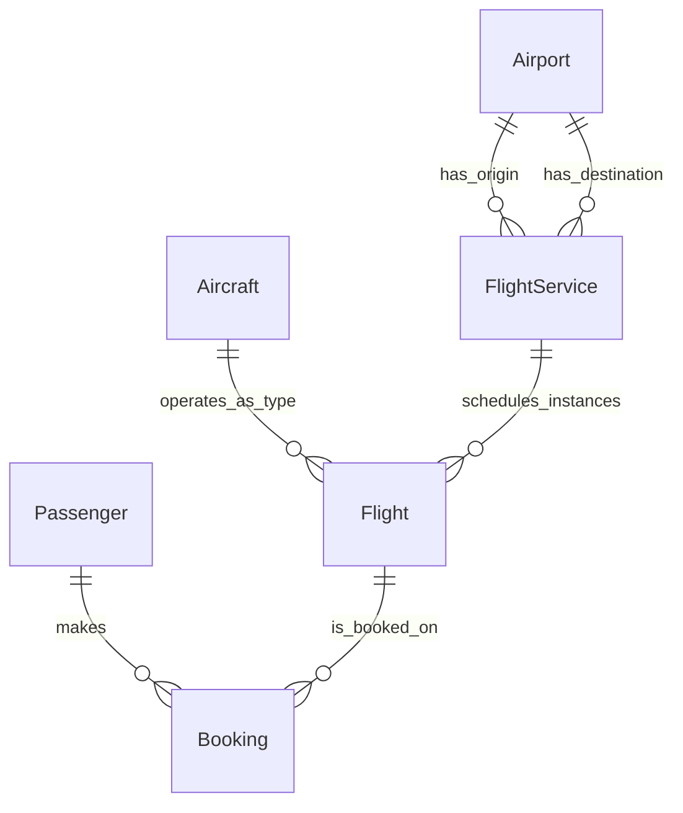

## Problem 2(b) – ER Model for Airline Flights & Booking

### Entities and Keys

- **Airport**
  - Attributes: `airport_code` (PK), `name`, `city`, `country`
  - Each airport represents a physical airport in a given city and country.
- **Aircraft**
  - Attributes: `plane_type` (PK), `capacity`
  - Represents a type/model of airplane, with a fixed seating capacity.
- **FlightService**
  - Attributes: `flight_number` (PK), `airline_name`, `origin_code`, `dest_code`, `departure_time`, `duration`
  - Represents a scheduled, recurring service (e.g., AA101 JFK→LAX at a fixed time and duration).
- **Flight**
  - Attributes: `flight_number` (FK → FlightService), `departure_date`, `plane_type` (FK → Aircraft), PK = (`flight_number`, `departure_date`)
  - Represents a **specific instance** of a flight service on a particular date, using a particular aircraft type.
- **Passenger**
  - Attributes: `pid` (PK), `passenger_name`
  - Represents an individual passenger.
- **Booking**
  - Attributes: `pid` (FK → Passenger), `flight_number`, `departure_date` (together FK → Flight), `seat_number`, PK = (`pid`, `flight_number`, `departure_date`)
  - Represents one passenger’s booking on a specific flight instance, with an assigned seat.

### Relationships and Cardinalities

- **Airport–FlightService (Origin)**
  - Relationship: `FlightService` has an origin `Airport`.
  - Implementation: `FlightService.origin_code` FK → `Airport.airport_code`.
  - Cardinality: One airport can be origin for **many** flight services; each flight service has **exactly one** origin airport.
  - Participation: `FlightService` participates totally in this relationship (must have an origin); `Airport` participates partially (may have no services).
- **Airport–FlightService (Destination)**
  - Relationship: `FlightService` has a destination `Airport`.
  - Implementation: `FlightService.dest_code` FK → `Airport.airport_code`.
  - Cardinality & participation: Symmetric to origin: one airport can be destination for many services; each service has exactly one destination.
- **FlightService–Flight**
  - Relationship: `Flight` is an instance of `FlightService`.
  - Implementation: `Flight.flight_number` FK → `FlightService.flight_number`.
  - Cardinality: One flight service can have **many** flight instances (different dates); each flight instance belongs to **exactly one** service.
  - Participation: `Flight` participates totally (cannot exist without a service); `FlightService` participates partially (may have no instances).
  - Design note: `Flight` can be modeled as a weak (or identifying) entity: its key (`flight_number`, `departure_date`) uses the PK of `FlightService` plus a discriminator (`departure_date`).
- **Aircraft–Flight**
  - Relationship: `Flight` uses an aircraft type.
  - Implementation: `Flight.plane_type` FK → `Aircraft.plane_type`.
  - Cardinality: One aircraft type can be used by **many** flights; each flight uses **exactly one** aircraft type.
  - Participation: `Flight` total (must have a plane type); `Aircraft` partial.
- **Passenger–Booking**
  - Relationship: Passenger makes bookings.
  - Implementation: `Booking.pid` FK → `Passenger.pid`.
  - Cardinality: One passenger can have **many** bookings; each booking refers to **exactly one** passenger.
  - Participation: `Booking` total (cannot exist without a passenger); `Passenger` partial.
- **Flight–Booking**
  - Relationship: Flight is booked by passengers.
  - Implementation: `Booking.(flight_number, departure_date)` FK → `Flight.(flight_number, departure_date)`.
  - Cardinality: One flight can have **many** bookings; each booking refers to **exactly one** flight.
  - Participation: `Booking` total (cannot exist without a flight); `Flight` partial.
  - Overall, `Booking` acts as an associative entity resolving a many-to-many conceptual relationship between `Passenger` and `Flight`.

### Weak Entities and Participation Summary

- **Weak / identifying entity**:
  - `Flight` depends on `FlightService` for part of its key (`flight_number`) and for existence; it is naturally modeled as a weak (or at least identifying) entity under `FlightService`.
- **Associative entity**:
  ## **Problem 2(b) – ER Model for Airline Flights & Booking**
  ### **Entities and Keys**
  - **Airport**
    - Attributes: `airport_code` (PK), `name`, `city`, `country`
    - Each airport represents a physical airport in a given city and country.
  - **Aircraft**
    - Attributes: `plane_type` (PK), `capacity`
    - Represents a type/model of airplane, with a fixed seating capacity.
  - **FlightService**
    - Attributes: `flight_number` (PK), `airline_name`, `origin_code`, `dest_code`, `departure_time`, `duration`
    - Represents a scheduled, recurring service (e.g., AA101 JFK→LAX at a fixed time and duration).
  - **Flight**
    - Attributes: `flight_number` (FK → FlightService), `departure_date`, `plane_type` (FK → Aircraft), PK = (`flight_number`, `departure_date`)
    - Represents a **specific instance** of a flight service on a particular date, using a particular aircraft type.
  - **Passenger**
    - Attributes: `pid` (PK), `passenger_name`
    - Represents an individual passenger.
  - **Booking**
    - Attributes: `pid` (FK → Passenger), `flight_number`, `departure_date` (together FK → Flight), `seat_number`, PK = (`pid`, `flight_number`, `departure_date`)
    - Represents one passenger’s booking on a specific flight instance, with an assigned seat.
  ### **Relationships and Cardinalities**
  - **Airport–FlightService (Origin)**
    - Relationship: `FlightService` has an origin `Airport`.
    - Implementation: `FlightService.origin_code` FK → `Airport.airport_code`.
    - Cardinality: One airport can be origin for **many** flight services; each flight service has **exactly one** origin airport.
    - Participation: `FlightService` participates totally in this relationship (must have an origin); `Airport` participates partially (may have no services).
  - **Airport–FlightService (Destination)**
    - Relationship: `FlightService` has a destination `Airport`.
    - Implementation: `FlightService.dest_code` FK → `Airport.airport_code`.
    - Cardinality & participation: Symmetric to origin: one airport can be destination for many services; each service has exactly one destination.
  - **FlightService–Flight**
    - Relationship: `Flight` is an instance of `FlightService`.
    - Implementation: `Flight.flight_number` FK → `FlightService.flight_number`.
    - Cardinality: One flight service can have **many** flight instances (different dates); each flight instance belongs to **exactly one** service.
    - Participation: `Flight` participates totally (cannot exist without a service); `FlightService` participates partially (may have no instances).
    - Design note: `Flight` can be modeled as a weak (or identifying) entity: its key (`flight_number`, `departure_date`) uses the PK of `FlightService` plus a discriminator (`departure_date`).
  - **Aircraft–Flight**
    - Relationship: `Flight` uses an aircraft type.
    - Implementation: `Flight.plane_type` FK → `Aircraft.plane_type`.
    - Cardinality: One aircraft type can be used by **many** flights; each flight uses **exactly one** aircraft type.
    - Participation: `Flight` total (must have a plane type); `Aircraft` partial.
  - **Passenger–Booking**
    - Relationship: Passenger makes bookings.
    - Implementation: `Booking.pid` FK → `Passenger.pid`.
    - Cardinality: One passenger can have **many** bookings; each booking refers to **exactly one** passenger.
    - Participation: `Booking` total (cannot exist without a passenger); `Passenger` partial.
  - **Flight–Booking**
    - Relationship: Flight is booked by passengers.
    - Implementation: `Booking.(flight_number, departure_date)` FK → `Flight.(flight_number, departure_date)`.
    - Cardinality: One flight can have **many** bookings; each booking refers to **exactly one** flight.
    - Participation: `Booking` total (cannot exist without a flight); `Flight` partial.
    - Overall, `Booking` acts as an associative entity resolving a many-to-many conceptual relationship between `Passenger` and `Flight`.
  ### **Weak Entities and Participation Summary**
  - **Weak / identifying entity**:
    - `Flight` depends on `FlightService` for part of its key (`flight_number`) and for existence; it is naturally modeled as a weak (or at least identifying) entity under `FlightService`.
  - **Associative entity**:
    - `Booking` is an associative entity for the many-to-many relationship between `Passenger` and `Flight`.
  Participation overview:
  - `FlightService` has total participation in:
    - Origin–Airport and Destination–Airport relationships (must have both origin and destination).
  - `Flight` has total participation in:
    - `FlightService–Flight` and `Aircraft–Flight` and `Flight–Booking` (a `Flight` must be tied to a service and an aircraft; every `Booking` must be tied to a `Flight`).
  - `Booking` has total participation in:
    - `Passenger–Booking` and `Flight–Booking` (must refer to both).
  - `Airport`, `Aircraft`, `Passenger`, `FlightService`, and `Flight` all have **partial** participation on the “one” side of their relationships (e.g., an airport may have no flights, a passenger may have no bookings).
  ### **Mermaid-style ER Sketch**
  has_originhas_destinationoperates_as_typeschedules_instancesmakesis_booked_onAirportFlightServiceAircraftFlightPassengerBooking
  - `Booking` is an associative entity for the many-to-many relationship between `Passenger` and `Flight`.

Participation overview:

- `FlightService` has total participation in:
  - Origin–Airport and Destination–Airport relationships (must have both origin and destination).
- `Flight` has total participation in:
  - `FlightService–Flight` and `Aircraft–Flight` and `Flight–Booking` (a `Flight` must be tied to a service and an aircraft; every `Booking` must be tied to a `Flight`).
- `Booking` has total participation in:
  - `Passenger–Booking` and `Flight–Booking` (must refer to both).
- `Airport`, `Aircraft`, `Passenger`, `FlightService`, and `Flight` all have **partial** participation on the “one” side of their relationships (e.g., an airport may have no flights, a passenger may have no bookings).

### Mermaid-style ER Sketch

