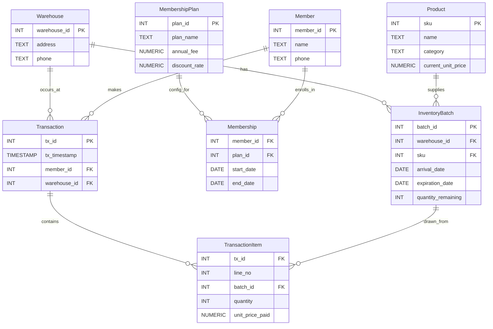

## Problem 3(a) – ER Diagram (Warehouse Inventory and Membership)

Below is an ER-style sketch using mermaid notation that corresponds to the schema in `p3_er_and_schema.md`.

This diagram matches the entities, keys, and relationships described in `p3_er_and_schema.md` and can be used as the ER “drawing” for part (a).

